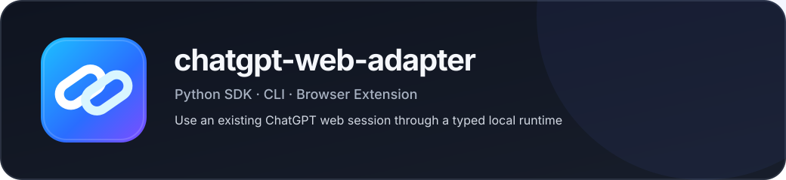

# chatgpt-web-adapter

<p align="center">
  
</p>

[](https://github.com/kymuco/chatgpt-web-adapter/actions/workflows/ci.yml)
[](https://pypi.org/project/chatgpt-web-adapter/)
[](https://pypi.org/project/chatgpt-web-adapter/)
[](LICENSE)

**Local product-runtime bridge for authenticated consumer AI web products.**

CWA lets local software, assistants and agents use ordinary hosted AI products through
typed runtime contracts without turning browser details, product observations or
partial output into implicit authority.

[Quickstart](docs/quickstart.md) · [Capabilities](docs/capabilities.md) · [Agent integration](docs/agent_integration.md) · [Documentation](docs/README.md) · [Providers](docs/providers.md) · [Status](STATUS.md) · [Architecture](docs/architecture.md) · [Security](SECURITY.md)

> [!WARNING]
> CWA is not an official API client for OpenAI, Google or DeepSeek. It works with
> ordinary consumer web products and depends on product behavior that may change.

> **Product observation is not authority. Incremental output is not canonical finality.
> Ambiguous writes are never automatically retried.**

## Start here

| You are... | Best first step |
| --- | --- |
| Trying CWA for the first time | [Quickstart](docs/quickstart.md) |
| Building a Python application | [Production Python example](#production-python-example) |
| Connecting a local assistant or coding agent | [Agent integration](docs/agent_integration.md) |
| Checking what is actually supported | [Capability map](docs/capabilities.md) |
| Adding a new hosted product capability | [Capability contribution guide](docs/adding_capability.md) |

Current proven product surfaces include:

- **ChatGPT** — production/default conversational runtime;
- **DeepSeek Web** — experimental text new-chat + continuation;
- **Gemini Web** — experimental text new-chat + continuation;
- **Google Translate Web** — experimental non-chat `translate_text` capability.

The Google Translate proof is intentionally separate from the conversation-shaped
provider contract. See [docs/capabilities.md](docs/capabilities.md).

## What CWA is

CWA sits between a local application and an authenticated consumer AI product:

```text
application / HDE / Codexia / terminal
                  |
                  v
        provider-specific runtime
          /          |          \
         /           |           \
   ChatGPT      DeepSeek Web    Gemini Web
 production     experimental    experimental
       |
       +---- each runtime is inspected / validated through
             ProductProviderBoundary schema 2
```

`ProductProviderBoundary` is **not** an execution router. It is a provider-neutral
metadata and invariant view over an already-created runtime.

The shared architecture preserves explicit:

- provider identity and product semantics;
- capability state;
- transport/support tier;
- execution provenance;
- canonical-readback requirements;
- write and retry authority;
- ambiguous-write reconciliation;
- finality claims.

Provider differences remain visible instead of being forced into a fake universal chat
API.

## Provider status on current `main`

| Capability / property | ChatGPT | DeepSeek Web | Gemini Web |
| --- | --- | --- | --- |
| Support tier | **Production/default** | Experimental | Experimental |
| Text new chat | Production | Live-proven | Live-proven |
| Text continuation | Production | Live-proven | Live-proven |
| Canonical conversation readback | Yes | No claim | No claim |
| Completion model | Canonical readback where required | Page-DOM stable completion, noncanonical | Page-DOM stable completion, noncanonical |
| Images / files | Production on proven browser-owned paths | Unimplemented | Unimplemented |
| Streaming | Production on proven paths | Unimplemented | Unimplemented |
| Model / reasoning profiles | Evidence-backed | Unknown | Unknown |
| Temporary Chat | Production text path | Unimplemented | Unimplemented |
| Web-search observation | Production on proven path | Unknown | Unknown |
| Public root runtime API | `ChatGPTProductRuntime` | Module-only | Module-only |

DeepSeek and Gemini are deliberately not presented as equally mature alternatives to
ChatGPT. Their current purpose is a real, live-proven provider implementation plus
evidence that the shared provider architecture is not ChatGPT-specific.

See [docs/providers.md](docs/providers.md) for the detailed matrix and finality model.

## Release vs current `main`

- **Latest public release:** `v0.3.0` — 2026-09-01.
- **Published package version:** `0.3.0`.
- **Current `main`:** includes substantial post-0.3 work, including the completed PR15
  architecture reset and experimental DeepSeek/Gemini provider proofs.

Do not assume every behavior described for current `main` exists in the published
0.3.0 wheel. [STATUS.md](STATUS.md) is the compact source of truth for release/main
differences.

## Why the browser-owned path is the default

For consumer web products, “browserless” is not automatically more reliable.

The browser already owns:

```text
authenticated session
cookies
frontend JavaScript
normal product navigation
page-owned upload/submit behavior
product challenge/protection state
```

The browser-owned strategy therefore keeps CWA's job bounded:

```text
resolve product surface
→ perform one governed write
→ observe / reconcile outcome
```

A reusable background runtime tab is an implementation resource, not public
conversation authority.

CWA still contains an experimental ChatGPT `browserless-request` transport, but it is
not the architectural target merely because it avoids Chrome. It remains fail-closed
around product protections and is not allowed to silently fall back or synthesize
challenge credentials.

See [docs/browser_owned.md](docs/browser_owned.md).

## Official APIs are different semantics

Official APIs can be excellent interfaces, but they are not the same thing as the
ordinary consumer product:

```text
OpenAI API  != ordinary ChatGPT product session
Gemini API  != ordinary Gemini consumer web session
DeepSeek API != ordinary DeepSeek consumer web session
```

CWA exists specifically for product semantics that live in the consumer product:
conversation state, product-native modes, browser-owned uploads, product UI behavior
and other evidence-backed product capabilities.

It is not intended to replace official APIs where API semantics are what the caller
actually wants.

## ChatGPT: production/default provider

ChatGPT remains the mature provider and the current production application path.

```text
application
    |
    v
ChatGPTProductRuntime
    |\
    | +---- ProductWriteTransport
    |        browser-owned = PRODUCTION
    |        browserless-request = EXPERIMENTAL
    |
    +------ CanonicalConversationClient
             canonical read / attach / status / finality
```

The historical `ChatGPTWebClient` remains available as a compatibility surface, but
new integrations should start with `ChatGPTProductRuntime`.

## Quick start — current production path

### Install

```bash
python -m pip install "chatgpt-web-adapter[browser]"
```

Requirements for the current ChatGPT production path:

- Python 3.10-3.14;
- Chrome/Chromium;
- an authenticated ChatGPT web session;
- the packaged extension + Native Messaging host;
- system `curl` where the canonical web-session client requires it.

### Authenticate

```bash
chatgpt-web-adapter auth login --auth-file auth_data.json
chatgpt-web-adapter auth status --auth-file auth_data.json
```

Treat `auth_data.json` and the associated signed-in browser profile as sensitive.
See [docs/authentication.md](docs/authentication.md) and [SECURITY.md](SECURITY.md).

### Install the browser bridge

```powershell
chatgpt-web-adapter browser-native install
chatgpt-web-adapter browser-native extension-dir
```

Load the printed directory through `chrome://extensions` → Developer mode → Load
unpacked, then verify:

```powershell
chatgpt-web-adapter browser-native status
cwa doctor --json
```

The extension popup is read-only local product chrome. Opening it does not create
write authority or submit a product turn.

### Send from the stable CLI

```powershell
cwa send "Give me a short project summary." --profile HIGH
```

Useful stable commands:

```powershell
cwa doctor --json
cwa status --json
cwa capabilities --json
cwa messages <conversation-id> --json
cwa snapshot <conversation-id> --name project --output-dir ./artifacts --json
cwa export <conversation-id> --format jsonl --name project --output-dir ./artifacts --json
```

Temporary Chat:

```powershell
cwa send "Answer briefly." --temporary --profile INSTANT
```

## Production Python example

```python
from chatgpt_web_adapter import assemble_product_runtime

runtime = assemble_product_runtime(
    transport="browser-owned",
    auth_file="auth_data.json",
)

health = runtime.health()
if not health.ready:
    raise RuntimeError(health.reason)

print(runtime.capabilities().to_dict())

execution = runtime.send_text_observed("Give me a short project summary.")
print(execution.response.text)
print(execution.provenance.to_dict())
print(execution.observations)
```

Canonical lifecycle access remains separate from mutation:

```python
status = runtime.get_status(conversation_id)
messages = runtime.get_messages(conversation_id)
attached = runtime.attach_conversation(conversation_id)
```

For a compact result, `runtime.send(...)` remains available.

## Rich input on ChatGPT

On the live-proven production/default browser-owned path:

```python
execution = runtime.send_text_observed(
    "Describe this image and summarize the notes.",
    media=["./diagram.png", "./notes.txt"],
)
```

The official page owns upload and protected submit. CWA validates the requested
attachment set and preserves the same no-fallback / no-automatic-retry boundaries as
ordinary text turns.

## Experimental providers

Current `main` contains module-only experimental runtimes for DeepSeek Web and Gemini
Web. They are intentionally not root-package production exports.

Minimal examples:

```python
from chatgpt_web_adapter.deepseek_web import DeepSeekWebRuntime

runtime = DeepSeekWebRuntime()
response = runtime.send_text("Reply with one short sentence.")
print(response.text)
```

```python
from chatgpt_web_adapter.gemini_web import GeminiWebRuntime

runtime = GeminiWebRuntime()
response = runtime.send_text("Reply with one short sentence.")
print(response.text)
```

These paths require the same local browser bridge and an authenticated session in the
corresponding web product. Current evidence covers text new-chat and continuation only.

They remain experimental because live acceptance proves observed behavior on the
current product revision; it does not make DOM/navigation mechanics a durable public
API.

## Provider-neutral inspection

Any conforming runtime can be inspected through the stable provider-neutral boundary:

```python
from chatgpt_web_adapter import product_provider_boundary

boundary = product_provider_boundary(runtime)
print(boundary.to_dict())
```

The boundary validates semantics such as:

```text
automatic_write_retry = false
fallback_transport = none
ambiguous_write_requires_reconciliation = true
incremental_observation_is_canonical_finality = false
```

and records whether canonical readback is required for that runtime.

## Capabilities and provenance

Do not infer capability from a provider name, transport string or visible UI control.

Use:

```python
capabilities = runtime.capabilities()
```

Canonical capability states are:

- `AVAILABLE`;
- `UNSUPPORTED`;
- `UNKNOWN`;
- `UNIMPLEMENTED`.

Support tier is a separate axis.

Execution provenance records what was actually observed. CWA does not synthesize
canonical completion or provider semantics merely to make heterogeneous providers look
uniform.

## Structured product observations

The mature ChatGPT runtime can expose immutable typed observations for search activity,
generic tool/activity points, source identity, citation relationships and
required-action evidence.

The governing rule is:

```text
product observation
!= product approval
!= connector authorization
!= write/retry authority
!= canonical finality
!= filesystem/Git/workspace authority
```

Current authenticated evidence remains conservative around generalized connector
execution and generated-artifact download.

## Conservative boundaries

Some visible product surfaces remain intentionally unpromoted.

```text
tools_connectors = UNKNOWN
```

CWA can observe bounded product-tool / required-action evidence on proven ChatGPT
paths, but current evidence does not justify a general connector execution contract.

Generated-artifact observation also remains separate from download authority:

```text
ARTIFACT_DOWNLOAD_HANDOFF_UNSUPPORTED_WITHOUT_STABLE_PRODUCT_IDENTITY
```

A future download handoff still requires stable product-owned artifact identity and a
safe resolution path; CWA does not infer identity from filename, prose, DOM position or
URL similarity.

These decisions originated in post-0.3 product work and remain current boundaries.

## Safety and failure model

CWA fails closed around uncertain product state.

- No automatic retry after an ambiguous write.
- No silent provider/transport fallback.
- Incremental output is not canonical finality.
- Page-DOM stable completion is not relabeled as canonical completion.
- Observation never grants approval or downstream action authority.
- CWA does not solve Turnstile, synthesize proof tokens or build challenge-bypass
  machinery.

For page-owned providers, uncertainty once the click-capable submit evaluation may
have executed is treated as reconciliation-required rather than replay permission.

See [docs/architecture.md](docs/architecture.md), [docs/providers.md](docs/providers.md)
and [SECURITY.md](SECURITY.md).

## Public surface tiers

CWA keeps support level explicit and machine-readable.

### Primary production

Use for new production integrations:

- `ChatGPTProductRuntime`;
- `assemble_product_runtime()`;
- `ProductProviderBoundary` / `product_provider_boundary()`;
- `ProductWriteTransport`;
- `CanonicalConversationClient`;
- capability/provenance/contracts and immutable structured observation values.

### Shared support

Auth/session helpers, common conversation/response/error types and media value types.

### Compatibility

`ChatGPTWebClient` / `WebChatClient` and historical workflows retained for existing
callers.

### Experimental

Backend/raw helpers, `browserless-request`, and provider-specific DeepSeek/Gemini
modules whose product mechanics may evolve faster.

Lower-level compatibility/research helpers such as `PayloadBuilder`,
`validate_payload`, and `send_payload` remain discoverable for existing callers and
diagnostics; they are not the recommended runtime foundation. See
[docs/raw_payload.md](docs/raw_payload.md).

### Research / diagnostic

Low-level browser-native, Sentinel, characterization and diagnostic surfaces.

Use `public_surface_tier(...)` for root-package classification.

## What stays outside CWA

CWA is not becoming:

- a full chat UI/TUI;
- an agent or task orchestrator;
- HDE/Codexia memory or project cognition;
- a Git/filesystem authority layer;
- a caller-controlled abstraction over every internal product tool;
- a provider failover router;
- a challenge/protection bypass toolkit;
- a generic model/API aggregator.

Downstream applications decide what to do with product evidence.

## Examples

Primary production example:

- [examples/product_runtime.py](examples/product_runtime.py)

Compatibility examples:

- [examples/basic_send.py](examples/basic_send.py)
- [examples/continue_saved.py](examples/continue_saved.py)
- [examples/attach_existing.py](examples/attach_existing.py)
- [examples/read_messages.py](examples/read_messages.py)
- [examples/status_polling.py](examples/status_polling.py)

Experimental examples:

- [examples/google_translate.py](examples/google_translate.py) — module-only non-chat translation capability;
- [examples/approve_tools.py](examples/approve_tools.py)
- [examples/raw_payload.py](examples/raw_payload.py)
- [examples/github_auto_approve.py](examples/github_auto_approve.py)

Research/diagnostic examples:

- [examples/browser_native_send.py](examples/browser_native_send.py)
- [examples/diagnose_latency.py](examples/diagnose_latency.py)
- [examples/watch_conversation.py](examples/watch_conversation.py)

Example classification follows the same support philosophy as the library: historical
or diagnostic code remains discoverable without becoming the recommended application
path.

## Documentation

Start with:

- [docs/quickstart.md](docs/quickstart.md) — shortest path from install to first result;
- [docs/capabilities.md](docs/capabilities.md) — discovery map across chat and non-chat surfaces;
- [docs/agent_integration.md](docs/agent_integration.md) — local assistants, coding agents and tool wrappers;
- [STATUS.md](STATUS.md) — current release/main checkpoint;
- [ROADMAP.md](ROADMAP.md) — current direction;
- [USAGE.md](USAGE.md) — usage guide;
- [docs/architecture.md](docs/architecture.md) — current architecture;
- [docs/providers.md](docs/providers.md) — provider capability/support matrix;
- [docs/browser_owned.md](docs/browser_owned.md) — browser-owned strategy;
- [docs/README.md](docs/README.md) — documentation map;
- [docs/authentication.md](docs/authentication.md) — ChatGPT authentication/session flow;
- [docs/troubleshooting.md](docs/troubleshooting.md) — operational troubleshooting;
- [docs/public_surface_pr8_6.md](docs/public_surface_pr8_6.md) — public-surface tier lineage;
- [docs/raw_payload.md](docs/raw_payload.md) — experimental raw/backend surface;
- [docs/rename_compatibility.md](docs/rename_compatibility.md) — historical package naming record;
- [SECURITY.md](SECURITY.md) — security boundary.

Historical PR-specific documents remain in `docs/` as evidence and architectural
lineage. Their presence does not make them current application documentation.

## Development

```bash
python -m pip install -e ".[test,browser]"
python -m pytest -q
```

Product-facing changes require deterministic regression coverage and bounded live
validation appropriate to the changed surface.

## Release integrity

CWA validates source tests on Ubuntu and Windows across Python 3.10-3.14, builds wheel
+ sdist, validates packaged assets/contracts, and smoke-tests the exact installed
wheel.

Tagged publication also requires:

```text
GitHub tag version == pyproject package version == dated CHANGELOG release heading
```

Latest public release: `v0.3.0`.

## Naming

Current names remain unchanged:

- repository: `chatgpt-web-adapter`;
- distribution: `chatgpt-web-adapter`;
- import: `chatgpt_web_adapter`;
- CLI: `cwa` and `chatgpt-web-adapter`.

Future naming is deliberately deferred to a separate discussion.

## License

MIT. See [LICENSE](LICENSE).
